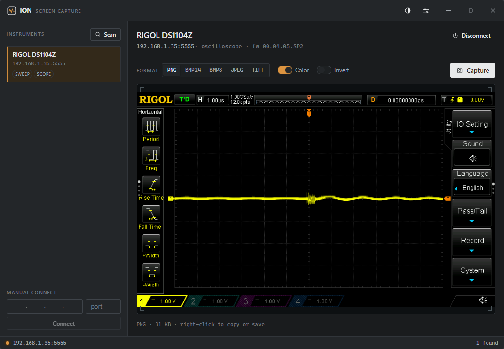

# ION — Screen Capture

**ION** (Instruments Over Network) is a suite of utilities for lab instruments on the LAN. This repository is the **Screen Capture** utility: discover SCPI/LXI instruments (oscilloscopes, DMMs, and other screen-equipped gear) on the network and grab their screens.

- **Discovery** — mDNS/DNS-SD, a parallel subnet sweep, and a VXI-11 broadcast, streamed live into a device picker. No typing IP addresses.
- **Capture** — vendor-aware screenshot over raw SCPI sockets (Rigol, Keysight, Siglent, Tektronix — scopes and DMMs), auto-detected from `*IDN?`.

Screen capture is the only feature: point it at any instrument that can produce a screenshot over SCPI and it saves or copies the image. No measurement, no data readout.



## Features

- Live network discovery (mDNS + subnet sweep + VXI-11) with a streaming device list.
- One-click capture with a graticule-style preview.
- Per-vendor image options where supported: format (PNG / BMP / JPEG / TIFF), colour, invert.
- Save to a folder and/or copy to the clipboard.
- Right-click the captured image to copy or save it on demand.
- A configurable global hotkey — capture from anywhere, even when the window is unfocused.

## Download

Grab the latest build from the [Releases](https://github.com/FireDeveloper/Fire-SCPI/releases) page:

- **Installer** — `…_x64-setup.exe` (NSIS) or `…_x64_en-US.msi`. Installs the WebView2 runtime automatically if it is missing.
- **Portable** — `…_x64-portable.exe`. A single file, no installation. Requires the Microsoft Edge **WebView2** runtime, which ships with Windows 11 and is present on virtually all Windows 10 machines.

Builds are unsigned, so Windows SmartScreen may show a one-time "unknown publisher" prompt — choose *More info → Run anyway*.

## Build from source

Requires [Node.js](https://nodejs.org) and the [Rust toolchain](https://rustup.rs) (MSVC on Windows).

```sh
npm ci
npm run tauri dev      # run in development
npm run tauri build    # build installers + the portable exe
```

Installers land in `src-tauri/target/release/bundle/`; the portable exe is `src-tauri/target/release/ion-screen-capture.exe`.

## Usage

1. **Scan** — discover instruments on the network, or enter a `host:port` manually.
2. **Connect** — ION reads `*IDN?` and selects the matching screenshot dialect.
3. **Capture** — grab the screen; choose format / colour / invert where the instrument supports them.
4. **Save / copy** — write to your folder, copy to the clipboard, or right-click the preview. The global hotkey (Settings → Shortcut) captures using the same options without focusing the window.

## License

[GPL-3.0](LICENSE) © 2026 ION
